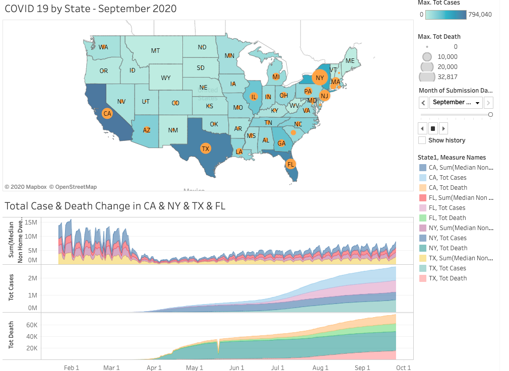

# Insight-Data-Engineering---Data Analytics - SafeDistancing

## Problem
As one of the biggest pandemics so far, COVID 19 has changed our daily life and even create a new word - social distancing. To each state government and the individual live in the state, it is important to know whether social distancing really works. My project will provide visualization to show whether social distancing with COVID 19 is absolute safety? How strong the relationship between social distancing and COVID 19 is?

## Goal/Solutions of Project
Based on 2 datasets - Social distancing and COVID-19 case number, the goal of this project is to prove the relationship between COVID 19 and people’s mobility and how strong it is.

## Dashboard

Note: This is how the dashboard looks like.

## Table of Contents
1. [Dataset](README.md#Datasets)
2. [Conclusion](README.md#Conclusion)
3. [Improvements](README.md#NextSteps)
4. [Tech](README.md#TechStack)
5. [Demo](README.md#Demo)
6. [Slides](README.md#Slides)

## Datasets
  

## Conclusion
* By a first step analysis, it is clear to see keeping a social distancing do help for preventing the spread of COVID 19 - Non home dwell time do have positive relationship with case numbers, though not very strong. 
* Social distancing is not the only determined factor on preventing the spread of COVID 19, whether people wear masks or wash their hands properly also matters.

## NextSteps
Adding more datasets will make the analysis more well-rounded.
* Social Distancing dataset should be more detailed and specific - current dataset only have non home dwell time, home dwell time, and etc. which are too general.
* Adding data for time lag between case numbers and people mobility will make the story be more practical and can be used for governments to know their state situatin. 
* Combining with Census data(population, age, and etc.) will make the story more comprehended and specific for different states, e.g. why NY has the highest death cases? 
* Adding data of wearing mask, washing hands and etc. would give a deeper analysis on COVID 19 factors and their impact.

## TechStack

## Demo
Please have a look for my whole visualizations by Tableau:
[My Demo](https://public.tableau.com/views/COVID19SocialDistancing_Story/COVID19SSocialDistancing_Story?:language=en&:display_count=y&:origin=viz_share_link)

## Slides
Here is my slides: 
[My Presentation Slides](https://docs.google.com/presentation/d/1Y4QQotyZhqJTQIB9IPosiE2lF6fg8_QJHbZusUrwjlc/edit?usp=sharing)

